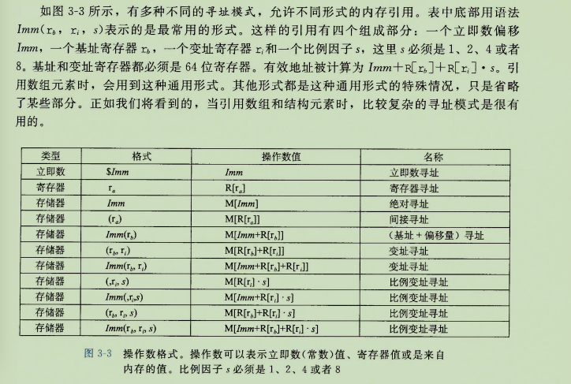
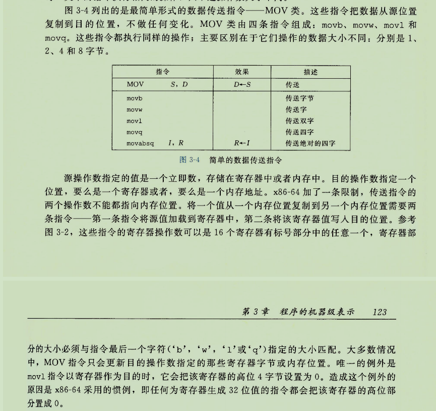
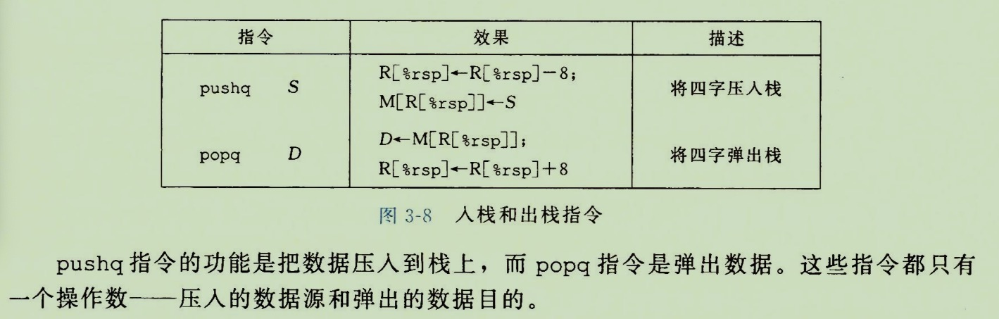

# 程序的机器级表示

## 3.2 程序编码

#### 机器级代码 汇编

* 程序计数器 PC %rip 表示；给出将要执行的下一条指令在内存中的地址。
汇编代码不区分有符号无符号整数，不区分各种类型的指针甚至说不区分指针和整数。
64位机器高16位必须是0 可用寻址2的48次方

## 3.3 数据格式

Intel 字 16位数据类型 32位 双字 double words 有64位 4字 quad words

| c声明 | Intel 字| 汇编后缀 | 大小（字节）|
| ------ | ------ | ------ |------ |
| char | 字节 | b | 1|
| short | 字 |w | 2|
| int | 双字 | l | 4|
| long | 四字 | q | 8|
| char * | 四字 | q | 8|
| float | 单精度 | s | 4|
| double | 双精度 | l | 8|

64位字节，指针8个字节

## 3.4 访问信息

x86-64 cpu 16个64位值的通用目的寄存器。低位运算可以访问低字节

#### 操作数指示符
指示出执行一个操作要使用的源数据，以及放置结果的目标位置。
源数据可以以常数形式给出，或者从寄存器或内存中读取
结果可以存放在寄存器或者内存中

* 立即数 immediate 表示常数值
* 寄存器 register ra表示任意寄存器a，R[ra] 表示它的值
* 内存引用 根据计算出的内存有效地址访问内存中的位置 Mb[Addr] 表示在内存中Addr地址开始的b个字节值的引用。

* 寻址模式

#### 数据传送指令

将数据从一个位置复制到另一个位置的指令

<h5 id="最简单形式的数据传送指令mov类指令">最简单形式的数据传送指令——MOV类指令。</h5>

 
 

<table><thead><tr class="header"><th>指令格式</th>
<th>指令功能</th>
<th>效果</th>
</tr></thead><tbody><tr class="odd"><td>movb S,D</td>
<td>传送一个字节（8位）</td>
<td>S-&gt;D</td>
</tr><tr class="even"><td>movw S,D</td>
<td>传送一个字（16位）</td>
<td>S-&gt;D</td>
</tr><tr class="odd"><td>movl S,D</td>
<td>传送双字（32位）</td>
<td>S-&gt;D</td>
</tr><tr class="even"><td>movq S,D</td>
<td>传送四字（32位扩展为64位）</td>
<td>S-&gt;D</td>
</tr><tr class="odd"><td>movabsq I,R</td>
<td>传送绝对的四字（64位）</td>
<td>I-&gt;R</td>
</tr></tbody></table>

源操作数可以为以下类型

<ul><li>立即数,例如$0x100</li>
<li>寄存器,例如%bp</li>
<li>存储器,例如(%rdi,%rcx)</li>
</ul>
目的操作数可为寄存器或存储器。

x86-64限制：传送指令源操作数及目的操作数不能都指向内存位置。

movabsq能够以任何64位数（立即数、寄存器、存储器）作为源操作数，但只能以寄存器作为目的操作数。

<h5 id="movz类指令">MOVZ类指令</h5>
<blockquote>

MOVZ类指令将较小的源值复制到较大的目的中去，将目的中剩余字节填充为0

</blockquote>

零扩展，格式为movz#&amp;（#为源操作数的大小，&amp;为目的操作数的大小）：

<ul><li>movzbw</li>
<li>movzbl</li>
<li>movzbq</li>
<li>movzwl</li>
<li>movzwq</li>
</ul>
注：无movzlq指令，movzlq可利用以寄存器位目的的movl实现（因为movl会将寄存器高位四字节置零）

<h5 id="movs类指令">MOVS类指令</h5>
<blockquote>

MOVS类指令将较小的源值复制到较大的目的中去，将源操作的最高为复制用于填充目的剩余字节，即传送符号扩展的字节

</blockquote>

符号扩展，格式为movs#&amp;（#为源操作数的大小，&amp;为目的操作数的大小）：

<ul><li>movsbw</li>
<li>movsbl</li>
<li>movsbq</li>
<li>movswl</li>
<li>movswq</li>
<li>movslq</li>
<li>cltq 把%eax符号扩展到%rax（eax为rax寄存器的低32位）类似于movslq %eax,%rax</li>

#### 压入和弹出栈数据

x86-64中，程序栈存放在内存的某个区域。栈向下增长
栈顶元素是所有栈中元素地址中最低的。栈指针%rsp保存栈顶元素的地址。（c语言）

* pushq
* popq 

 

 #### 算法和逻辑运算
 

